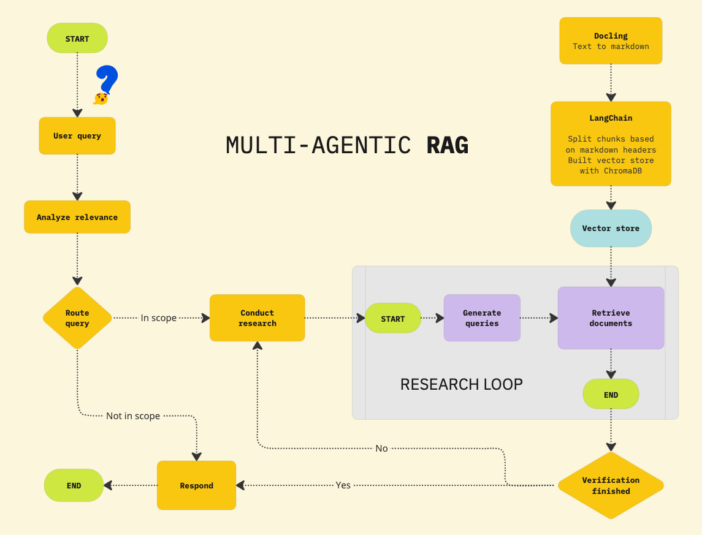
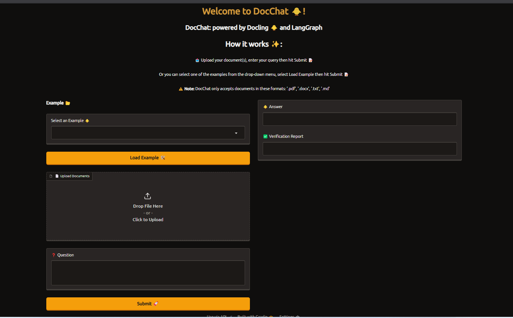
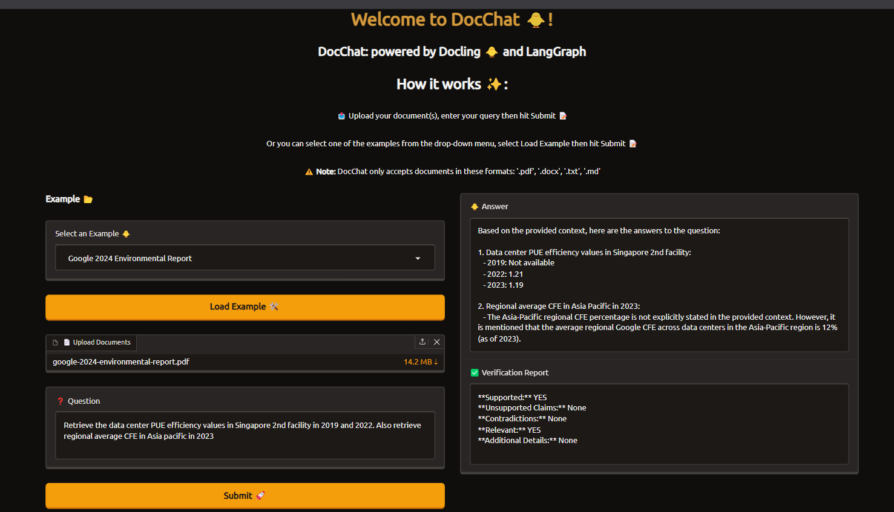

# DocChat: Build a Multi-Agent RAG System

### Welcome to DocChat!
Have you ever struggled to extract precise information from long, complex documents? Whether it's a research paper, legal contract, technical report, or environmental study, finding the exact details you need can feel overwhelming.

That's where `DocChat` comes in—a multi-agent RAG tool designed to help you ask questions about your documents and receive fact-checked, hallucination-free answers.

Sure, you could use ChatGPT or DeepSeek to accomplish this task, but when dealing with long documents containing multiple tables, images, and dense text, these models struggle with retrieval and are prone to hallucinations.

They often misinterpret tables, overlook key data hidden in footnotes, or even fabricate citations, as demonstrated below. The problem? These models lack document-aware reasoning and don't verify their responses against structured sources.

That's why DocChat takes a different approach. Instead of relying on a single LLM, it combines multiple AI agents, each with a specific role:

    * A Hybrid Retriever that intelligently combines **BM25** keyword search and **vector embeddings** to retrieve the most relevant passages
    * A **Research Agent** that analyzes the retrieved content and generates an initial response
    * A **Verification Agent** that cross-checks the response against the original document to detect hallucinations and flag unsupported claims
    * A **Self-Correction Mechanism** that re-runs the research step if any contradictions or unsupported statements are found

This multi-step, verification-driven approach ensures that DocChat provides precise, document-grounded answers, even for complex and long-form documents that general-purpose chatbots struggle with. Whether you need to extract specific data points, summarize sections, compare multiple reports, or analyze tables, DocChat is built to help you navigate your documents with confidence.

## A quick look at DocChat

### What does the DocChat app do?

With DocChat, you can:

* Upload and analyze long documents (PDFs, Word files, text reports) with ease
* Ask questions about the content and get precise, source-backed answers
* Extract specific details from structured documents, even those with tables, figures, and dense text
* Avoid AI hallucinations—every response goes through a verification step to ensure factual correctness
* Receive an alert when your question is irrelevant to the uploaded documents—so you know when the AI cannot confidently answer based on the provided sources
* Retrieve accurate answers even when multiple documents are uploaded—DocChat intelligently finds the right document to reference

### DocChat Architecture

---

### Application Images

---

---
---

# Understand why multi-agent RAG is used

A [Naïve RAG (Retrieval-Augmented Generation)](https://research.ibm.com/blog/retrieval-augmented-generation-RAG) pipeline is often insufficient for handling long, structured documents due to several limitations:

* **Limited query understanding:** Naïve RAG processes queries at a single level, failing to break down complex questions into multiple reasoning steps. This results in shallow or incomplete answers when dealing with multi-faceted queries.

* **No hallucination detection or error handling:** Traditional RAG pipelines lack a verification step. This means that if a response contains hallucinated or incorrect information, there's no mechanism to detect, correct, or refine the output.

* **Inability to handle out-of-scope queries:** Without a proper scope-checking mechanism, Naïve RAG may attempt to generate answers even when no relevant information exists, leading to misleading or fabricated responses.

* **Inefficient multi-document retrieval:** When multiple documents are uploaded, a Naïve RAG system might retrieve irrelevant or suboptimal passages, failing to select the most relevant content dynamically.

To overcome these challenges, DocChat implements a multi-agent RAG research system, which introduces intelligent agents to enhance retrieval, reasoning, and verification.

### How multi-agent RAG solves these issues

#### Scope checking & routing

* A Scope-Checking Agent first determines whether the user's question is relevant to the uploaded documents. If the query is out of scope, DocChat explicitly informs the user instead of generating hallucinated responses.

#### Dynamic multi-step query processing

* For complex queries, an Agent Workflow ensures that the question is broken into smaller sub-steps, retrieving the necessary information before synthesizing a complete response.
* For example, if a question requires comparing two sections of a document, an agent-based approach recognizes this need, retrieves both parts separately, and constructs a comparative analysis in the final answer.

#### Hybrid retrieval for multi-document contexts

When multiple documents are uploaded, the Hybrid Retriever (BM25 + Vector Search) ensures that the most relevant document(s) are selected dynamically, improving accuracy over traditional retrieval pipelines.

#### Fact verification & self-correction

* After an initial response is generated, a Verification Agent cross-checks the output against the retrieved documents.
* If any contradictions or unsupported claims are found, the Self-Correction Mechanism refines the answer before presenting it to the user.

#### Shared global state for context awareness

* The Agent Workflow maintains a shared state, allowing each step (retrieval, reasoning, verification) to reference previous interactions and refine responses dynamically.
* This enables context-aware follow-up questions, ensuring that users can refine their queries without losing track of previous answers.

# Project overview

## Below is a breakdown of DocChat's workflow

### 1 - User query processing & relevance analysis

* The system starts when a user submits a question about their uploaded document(s)
* Before retrieving any data, DocChat first analyzes query relevance to determine if the question is within the scope of the uploaded content

### 2 - Routing & query categorization

* The query is routed through an intelligent agent that decides whether the system can answer it using the document(s):
    * In scope: Proceed with document retrieval and response generation.
    * Not in scope: Inform the user that the question cannot be answered based on the provided documents, preventing hallucinations.

### 3 - Multi-agent research & document retrieval

* If the query is relevant, DocChat retrieves relevant document sections from a hybrid search system:
    * Docling converts the document into a structured Markdown format for better chunking
    * LangChain splits the document into logical chunks based on headers and stores them in ChromaDB (a vector store)
    * The retrieval module searches for the most contextually relevant document chunks using BM25 and vector search

### 4 - Answer generation & verification loop

* Conduct research:
    * The research agent generates an initial answer based on retrieved content
    * A sub-process starts where queries are dynamically generated for more precise retrieval

* Verification process:
    * The verification agent cross-checks the generated response against the retrieved content
    * If the response is fully supported, the system finalizes and returns the answer
    * If verification fails (e.g., hallucinations, unsupported claims), the system re-runs the research step until a verifiable response is found

#### 5 - Response finalization

* After verification is complete, DocChat returns the final response to the user
* The workflow ensures that each answer is sourced directly from the provided document(s), preventing fabrication or unreliable outputs

## Build vector database

### 1. Document parsing with Docling

Processing PDFs with complex structures, tables, and intricate layouts requires careful selection of a reliable document parsing tool. Many libraries struggle with accuracy when dealing with nested tables, multi-column formats, or scanned PDFs, often resulting in misaligned text, missing data, or broken layouts.

To overcome these challenges, DocChat leverages [Docling](https://github.com/DS4SD/docling)—an open-source document processing library designed for high-precision parsing and structured data extraction.

#### Why Docling?

* **Accurate table & layout parsing:** Recognizes complex table structures, reading sequences, and multi-column layouts
* **Multi-format support:** Reads and exports documents in Markdown, JSON, PDF, DOCX, PPTX, XLSX, HTML, AsciiDoc, and images
* **OCR for scanned PDFs:** Extracts text from scanned documents using optical character recognition (OCR)
* **Seamless integration with LangChain:** Enables structured chunking for better retrieval and vector search in ChromaDB

To showcase Docling's superiority over LangChain in handling complex PDFs, we compare both tools on two types of scanned PDF documents: [one saved as an image file](https://cf-courses-data.s3.us.cloud-object-storage.appdomain.cloud/ZuJr98YqE3X-PD3afPqYSQ/sample.png) and [another saved as a standard PDF.](https://cf-courses-data.s3.us.cloud-object-storage.appdomain.cloud/l_FOzUo4tpjUyBmfZ9ilVw/ocr-test.pdf)

This script compares Docling and LangChain in parsing text from PDF documents. It processes PDFs using both approaches and prints the extracted content for evaluation.

#### The Docling approach

* Uses `DocumentConverter` to extract structured content
* Converts the PDF into Markdown format
* Splits the extracted content based on headers using `MarkdownHeaderTextSplitter`
* Prints the full extracted sections for review

#### LangChain approach

* Uses `PyPDFLoader` to load the document
* Extracts raw text from each PDF page
* Prints the entire extracted text

As demonstrated in the results, Docling successfully extracts text from both scanned file versions, whether saved as an image or as a PDF. In contrast, LangChain's built-in PyPDFLoader fails to extract text from both cases, highlighting a major limitation.

This occurs because PyPDFLoader is designed for digitally generated PDFs that contain embedded text, rather than scanned documents where the text is essentially an image. Since LangChain does not have built-in OCR (Optical Character Recognition) capabilities, it cannot process PDFs that contain scanned images of text, making it ineffective for handling historical documents, academic papers, or other non-digitally generated content.

On the other hand, Docling is equipped to handle both structured and unstructured PDFs, including scanned documents, making it a far more versatile and reliable tool for text extraction in complex scenarios. This demonstrates Docling's advantage in working with real-world PDFs, where many documents are scanned rather than digitally created.

### Building a vector database with ChromaDB

Once documents have been parsed and structured using Docling, the next step is to efficiently store and retrieve relevant document chunks. This is where ChromaDB comes into play—a high-performance vector database optimized for fast and accurate similarity search.

#### What is Chroma DB?

[Chroma DB](https://github.com/chroma-core/chroma) is an open-source vector database optimized for fast and scalable similarity search. It enables efficient storage, retrieval, and ranking of document embeddings, making it a key component of RAG workflows.

#### Why ChromaDB?

* **Blazing-fast vector search:** Finds the most relevant document chunks in milliseconds
* **Persistent storage:** Keeps embeddings saved for reuse across sessions
* **Seamless LangChain integration:** Works natively with LangChain for retrieval-augmented generation (RAG)
* **Scalable and lightweight:** Handles millions of embeddings efficiently without complex infrastructure

#### Overview
The `DocumentProcessor` class is responsible for handling document parsing, caching, and chunking. It ensures efficient processing by:

* Validating file sizes before processing
* Using caching to avoid redundant processing of previously uploaded files
* Extracting structured content from documents using Docling
* Splitting text into chunks using MarkdownHeaderTextSplitter for better retrieval in vector databases 

## LangGraph multi-agent system structure
Understanding LangGraph: a multi-agent orchestration framework

### 1. What is agentic AI?

[Agentic AI](https://www.ibm.com/think/insights/agentic-ai) describes a system or program that can independently execute tasks for a user or another system. It autonomously designs workflows, utilizes available tools, makes decisions, takes actions, solves complex problems, and interacts with external environments, extending its capabilities beyond the data used to train its machine learning (ML) models.

### 2. What is a multi-agent system (MAS)?

A [multi-agent system (MAS)](https://www.ibm.com/think/topics/multiagent-system) is composed of multiple artificial intelligence (AI) agents collaborating to carry out tasks for a user or another system.

### 3. Key relationship between agentic AI and MAS

| **Characteristic** |	**Agentic AI** |	**Multi-agent systems (MAS)** |
| ------------------ | --------------- | -------------------------------- |
| Autonomy           | Central focus—autonomous task execution     | May include agents with varying levels of autonomy |
| Interaction        |	Limited to tools, systems, or environments |  Key focus—agents interact, communicate, and coordinate |
| Scope	             | Individual agent                            | Multiple agents in a shared system |
| Dependency         |	Agentic AI can exist independently         | MAS may involve agentic AI but doesn't require it |

### 4. What is LangGraph?

LangGraph is an open-source Python framework designed for multi-agent workflows in AI applications. It extends LangChain by enabling graph-based state management, making it easier to coordinate multiple AI agents in structured workflows.

LangGraph is particularly useful in RAG and multi-step reasoning, where multiple agents collaborate to refine, verify, and improve responses dynamically.

#### Key features of LangGraph

* **Graph-based execution:** Workflows are defined as state machines, allowing structured decision-making
* **Multi-agent coordination:** Easily integrates multiple agents, each responsible for a specific task
* **Dynamic state management:** Maintains memory and enables iterative refinement of AI-generated responses
* **Supports loops & conditionals:** Workflows can adapt based on real-time decisions

### 5. How does LangGraph work?

LangGraph operates on the principle of stateful workflows, where each step in the process is defined as a node in a directed graph. The edges define transitions between nodes based on logic.

A LangGraph workflow consists of:

* **Nodes:** They represent individual processing steps (for example, research, verification).
* **Edges:** They define the flow of execution (for example, go to verification after research).
**State objects:** They store data passed between agents.
* **Conditional transitions** → Allow decision-making between nodes.

### 6. Graph structure for this project

The AgentWorkflow class constructs the multi-agent system using **LangGraph's** `StateGraph`, ensuring a structured approach to information retrieval and verification.

#### Workflow breakdown

1. **Check relevance** – The RelevanceChecker determines if the query can be answered based on the retrieved documents.
    * If relevant → Proceed to research
    * If irrelevant → Terminate workflow

2. **Research step** – The ResearchAgent generates a draft answer using relevant documents.

3. **Verification step** – The VerificationAgent assesses the draft answer for accuracy and relevance.

4. **Decision making** – Based on verification:

    * If the answer lacks support → Re-research and refine
    * If verified → End workflow

## Hybrid retriever: combining BM25 and vector search for optimal document retrieval

The `RetrieverBuilder` class implements a hybrid retrieval system by combining:

1. **BM25 (Lexical Search):** Traditional keyword-based retrieval
2. **Vector Search (Embedding-based):** Semantic retrieval using embeddings

This combination enhances the accuracy of RAG by leveraging the strengths of both approaches.

### Why use a hybrid retriever?

* **Improves recall:** Captures both exact keyword matches and semantically similar content
* **Balances precision & relevance:** BM25 retrieves highly precise keyword matches, while vector retrieval finds related concepts
* **Handles misspellings & variations:** Vector embeddings allow for fuzzy matching beyond exact keyword searches
* **Optimized for multi-agent systems:** Ensures robust document retrieval before passing data to AI agents

### Why is this is essential for RAG?

* Ensures high-quality document retrieval for multi-agent research workflows
* Improves AI response accuracy by providing both keyword-based and semantic matches
* Enhances retrieval diversity, ensuring that no relevant document is overlooked
* With hybrid retrieval, the system achieves a balance between precision and recall, ensuring that AI-generated responses are grounded in the most relevant information.

### Why use Gradio?
Gradio is a powerful Python library for building web-based interfaces for machine learning and AI models. While we provide a simple Gradio-based interface to start with, customizing the interface further is beyond the scope of this project. You are welcome to explore more advanced Gradio features to enhance the user experience.

### How the application works

The app follows a structured workflow:

1. Users upload documents or select a predefined example.
2. The hybrid retriever extracts relevant document chunks.
3. The multi-agent system (LangGraph) processes the query.
4. The AI generates an answer & a verification report.
5. The response is displayed in the Gradio interface.

### What you can do next

Now that you've built the core system, here are some next steps to further enhance your project:

* **Try different embedding models:** Experiment with **OpenAI, Hugging Face, or custom-trained embeddings** to compare retrieval performance

* **Enhance the RAG pipeline:** Improve the **retriever's ranking logic**, adjust **retrieval weights**, or add **post-processing** for better answer formulation

* **Implement Guardrails & AI trust mechanisms:** Use **Llama Guard, AI moderation tools, or manual review processes** to ensure responsible AI usage

* **Optimize the multi-agent workflow:** Tune **verification heuristics, introduce feedback loops, or implement self-improving AI responses**

* **Scale & deploy the app:** Deploy **DocChat** on a cloud service (e.g., Hugging Face Spaces, AWS, or IBM Cloud) to make it widely accessible

* **Customize the UI:** Modify the **Gradio interface** to improve user experience, **add chat history tracking**, or enable **document annotations**.

### Final thoughts

This project demonstrates how advanced AI retrieval techniques, multi-agent collaboration, and structured workflows can be combined to build real-world, AI-driven applications. Whether you're enhancing business intelligence, legal document analysis, or research assistance, this framework provides a solid foundation for creating intelligent document retrieval systems.